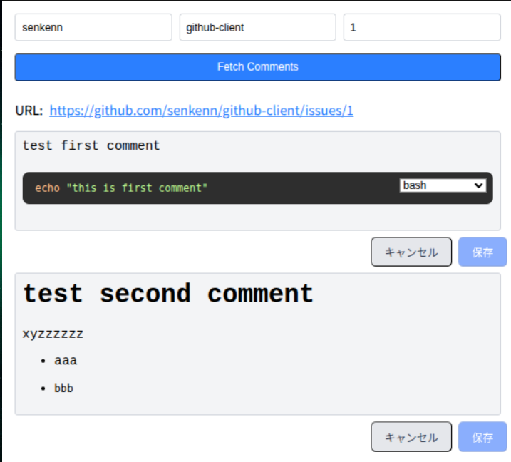

# GitHub Client

Edit GitHub Issues using a WYSIWYG editor.



## Features

- Browse and search GitHub issues with advanced filtering
- Edit issue descriptions and comments using a rich text editor
- Support for GitHub-style markdown rendering
- Real-time search with GitHub-like query syntax
- Responsive design with modern UI components
- Optimistic updates with automatic rollback on errors

## Usage

### Development Setup

1. Clone this repository:

   ```bash
   git clone https://github.com/senkenn/github-client.git
   cd github-client
   ```

2. Install dependencies:

   ```bash
   npm install
   ```

3. Add your GitHub token to `.env`:

   ```bash
   echo VITE_GITHUB_TOKEN=$(gh auth token) > .env
   ```

4. Start the development server:

   ```bash
   npm run dev
   ```

   Access the application at `http://localhost:5173`

### Production Deployment

1. Build the application:

   ```bash
   npm run build
   ```

2. Start with Docker Compose:

   ```bash
   docker compose up -d
   ```

   Access at `http://localhost:7777`

## Development

### Available Scripts

- `npm run dev` - Start development server
- `npm run build` - Build for production
- `npm run lint` - Run linter (Biome)
- `npm run lint:fix` - Fix linting issues
- `npm run test` - Run unit tests (Vitest)
- `npm run test:e2e` - Run E2E tests (Playwright)

### Testing

The project uses a focused testing strategy:

- **Unit Tests (Vitest)**: For utility functions, parsers, and business logic
- **E2E Tests (Playwright)**: For UI interactions, routing, and integration testing

Run tests before making changes:

```bash
npm run lint && npm run test && npm run test:e2e
```

### Architecture

- **Frontend**: React with TypeScript and TanStack Router
- **Styling**: Tailwind CSS v4
- **Editor**: Tiptap rich text editor
- **API**: GitHub REST API via Octokit
- **Testing**: Vitest for unit tests, Playwright for E2E

### Key Components

- `IssueDetail.tsx` - Issue view with editing capabilities
- `IssuesList.tsx` / `IssuesListUI.tsx` - Issue listing with search/filter
- `FilterBar.tsx` - GitHub-style search and filtering
- `TiptapEditor.tsx` - Rich text editor for markdown content
